# Running an engagement as red

Blacklight is a purple-team assessment tool, and red and blue work the same
workbook: an ordered chain of scenarios and ATT&CK-mapped steps. Red executes a
technique; blue scores what their tooling saw and stopped. Every step ends with
a detection category, a protection outcome, and — when both timestamps exist — a
time-to-detect. This page is the offensive seat: how to take an emulation plan
from an empty workbook to a scored kill chain, recording what ran, what was
prevented, and what slipped through undetected.

Nothing here is red-only knowledge that blue must not have. The value of the
tool is that both sides read the same record; the gaps you leave visible are the
findings that drive remediation, and the retest is where they are proven closed.

The screens below are from a live build seeded with an APT29 emulation
engagement. The adversary names, hosts, and findings are illustrative.

## The loop

1. **Scope.** Read the engagement brief and, above all, its *mode*.
2. **Build.** Turn a plan into scenarios and ATT&CK-mapped steps.
3. **Execute.** Run each TTP for real and record it as you go.
4. **Score.** Blue rates detection and prevention against your executions.
5. **Findings.** Raise the gaps a missed or slow detection exposed.
6. **Measure.** Coverage, MTTD, and protection roll up; the retest prints the delta.

## Signing in and finding your engagement

Blacklight is a single self-hosted binary. You are handed a URL and either a
local account or single sign-on; every screen past the sign-in form needs a
session. Local accounts use Argon2id passwords with admin-enforceable TOTP, and
OIDC and SAML are available for enterprise SSO.

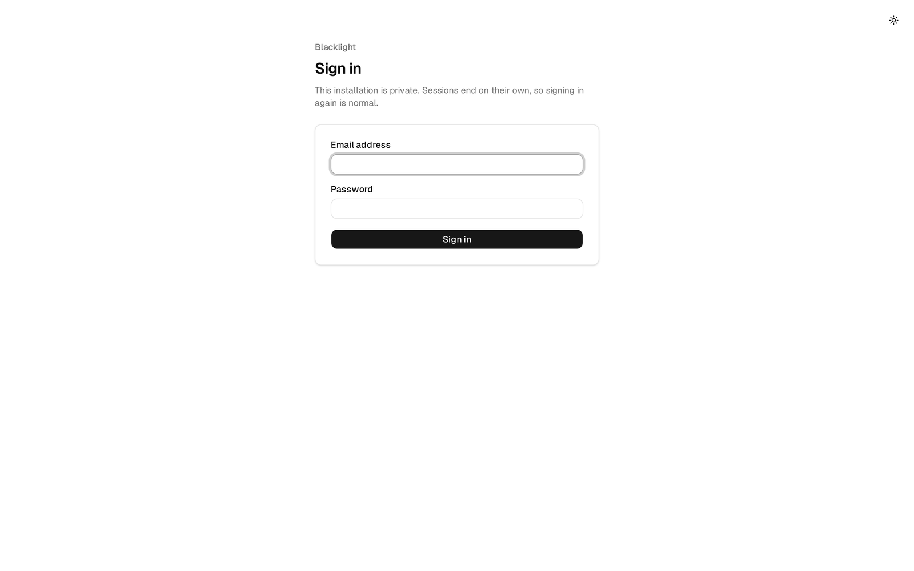

The landing screen is **Engagements** — the assessments you are a member of.
Each row shows the client, status, *mode*, the ATT&CK version the engagement is
pinned to, and its window. Open the one you have been assigned to.

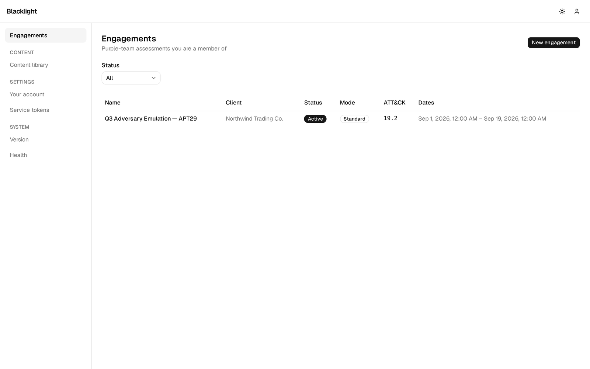

## Reading the brief

The **Overview** tab is your rules of engagement at a glance: scope in the
description, the ATT&CK version, the assessment dates, and the member roster with
roles. Two lines decide how you operate.

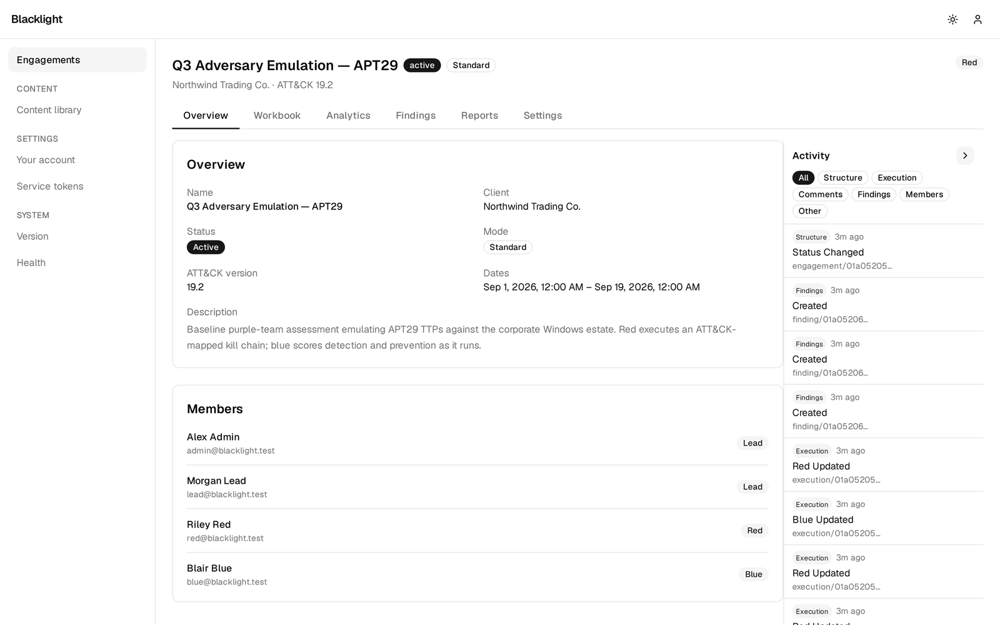

**ATT&CK version.** The pinned release — `19.2` here — is what every step's
technique ID resolves against. Pinning is deliberate: a step assessed against one
release means something different against another, so an engagement is not
silently remapped when a newer ATT&CK is installed later. See
[`content-attack.md`](content-attack.md) for how versions coexist.

**Mode.** `standard` or `blind`, and this is the most important word on the page
for a red operator. In a **blind** engagement, blue cannot see your steps until
you *reveal* them — the point is to test detection without tipping the analysts
off, so do not reveal a step before you have run it, and keep execution detail
out of shared comments. In **standard** mode everyone sees the workbook live;
it is collaborative, closer to a training exercise. The badge on the overview
and in the header tells you which you are in.

## Building the workbook

A workbook is **scenarios** — phases of the operation — containing ordered
**steps**, each an individual TTP. The Workbook tab's toolbar gives you four
ways to fill it: **Add Scenario**, **Add Step**, **Import CTID**, and **From
Template**. Most engagements start by importing a published emulation plan and
trimming it to scope.

### Import an adversary emulation plan

**Import CTID** turns a Center for Threat-Informed Defense emulation plan —
APT29, FIN6, Wizard Spider, Sandworm, and the rest — into a ready-made scenario
with its steps in order. Pick the plan, optionally rename the scenario, set the
starting ordinal, and import. Every step's ATT&CK mapping comes across intact, so
coverage and the heatmap populate the moment you import. The mechanics of how a
catalog plan becomes engagement steps are in
[`content-ctid.md`](content-ctid.md).

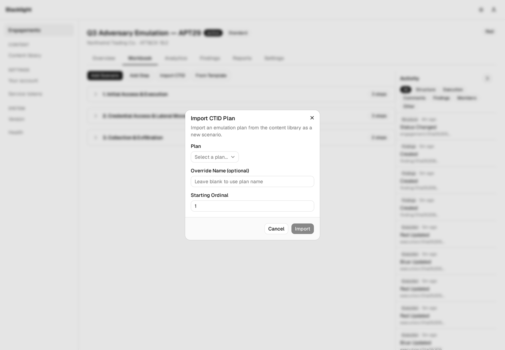

### Add a step by hand

For anything a plan does not cover — a client-specific path, an opportunistic
technique you found on the box — add a step directly. Name it after the
objective, drop in the technique ID, and note the target asset. The ID is
validated against the engagement's pinned ATT&CK version.

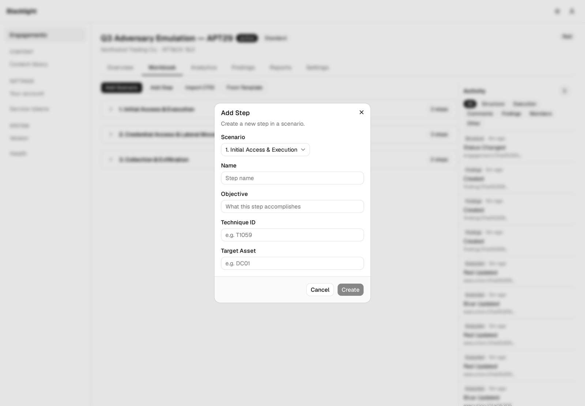

**From Template** does the same from your own reusable step templates; authoring
those lives under custom content ([`content-custom.md`](content-custom.md)).

## The content library

The **Content library** is your reference arsenal: everything installed,
browsable offline. As a red operator you will live in three of its tabs.

**Techniques** is the full MITRE ATT&CK matrix for the installed version — here
1,863 techniques and sub-techniques. Search by ID or name, filter by tactic, and
open any technique to read it or hand it to a scenario step.

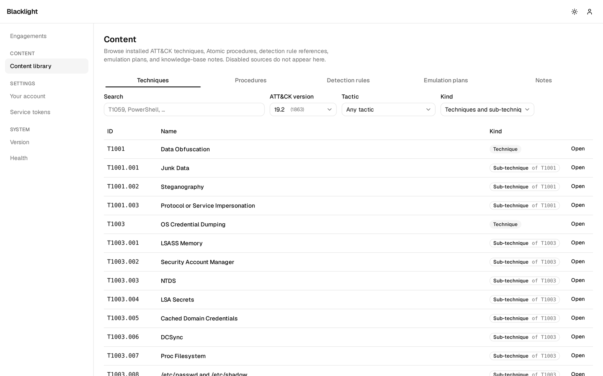

**Procedures** is Atomic Red Team — the actual *how*. Each template keeps its
platforms, executor, command, input args, and cleanup as distinct fields, so you
copy a real invocation rather than reinvent one. Filter by technique or platform
to find the recipe that fits the target. See
[`content-atomic.md`](content-atomic.md).

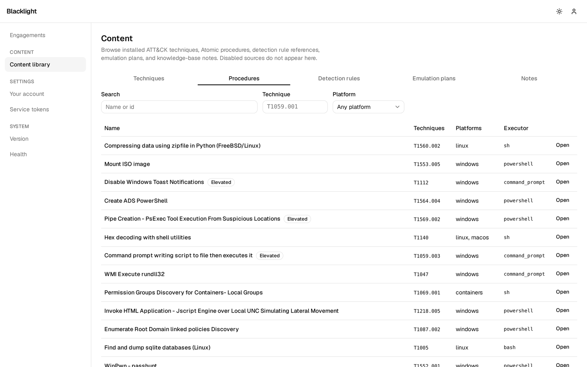

**Emulation plans** is the CTID library as a browsable catalog of named
adversaries — the source the **Import CTID** button pulls from. Open a plan to
study the chain before you commit it to a scenario.

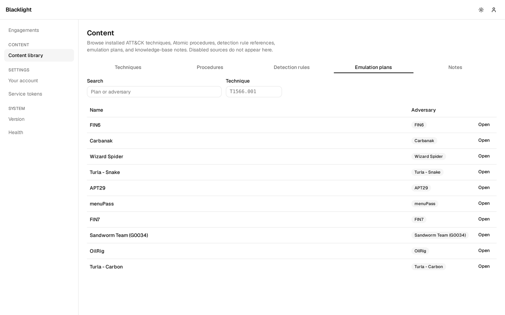

The **Detection rules** (Sigma) and **Notes** tabs are reference-only — Sigma
rules are never executed ([`content-sigma.md`](content-sigma.md)). They are
primarily blue's, but worth a glance: they tell you what detection logic *might*
be watching for the technique you are about to run.

## Executing and recording a step

This is where you spend the engagement. Open any step to get its execution
drawer: a red panel you own and a blue panel the defenders own, side by side. The
rhythm for each TTP is **Start → run it for real → Complete → fill in the
detail.**

**Start** stamps `started_at` and begins a live timer — press it the moment you
fire the technique, because that timestamp is one half of the time-to-detect
measurement. Run the technique against the target in your own tooling. **Stop**
or **Complete** stamps `ended_at`.

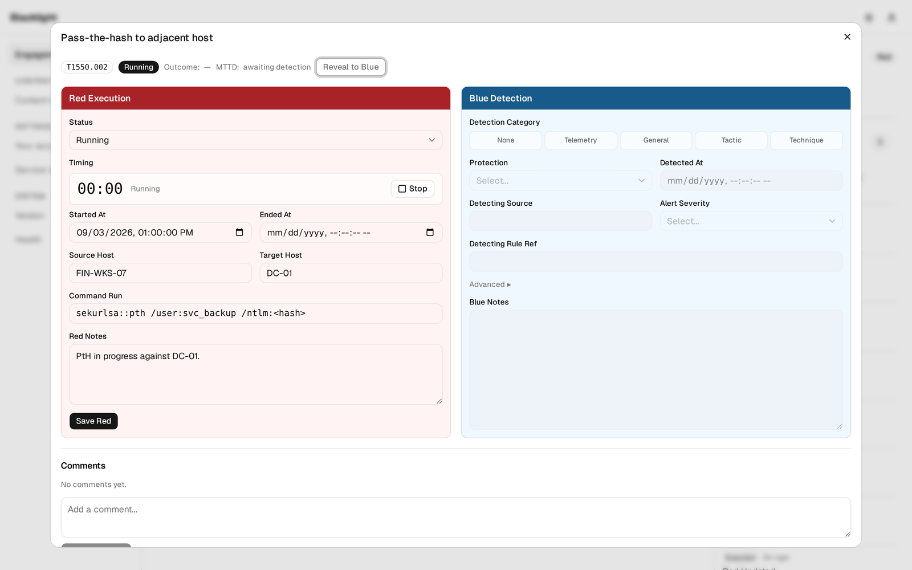

Then record what you did. On the **Red Execution** panel:

- **Status** — `pending` → `running` → `complete`.
- **Started / Ended At** — set by the buttons, or typed for a run that happened
  away from the workbook.
- **Source / Target Host** — where you ran from and what you hit.
- **Command Run** — the exact invocation, for repeatability.
- **Red Notes** — what happened, and what got blocked.

The **Blue Detection** panel is filled by the analysts — detection category,
protection level, the moment detection fired, which tool and rule caught it,
severity, and modifiers. You will see it populate as they score.

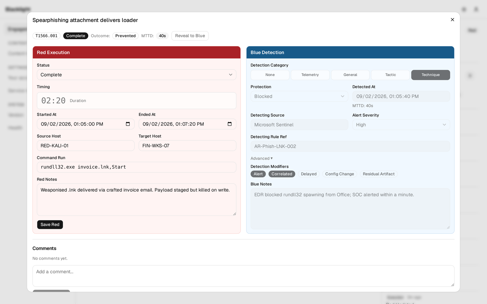

Three controls round out the drawer:

- **Reveal to Blue**, at the top, is what surfaces a step to the analysts in a
  blind engagement. Use it only after you have executed.
- **Evidence** attaches a screenshot or capture to the execution; it is stored in
  the content-addressed blob store and backed up with the database.
- The per-step **comment thread** is the war-room conversation about that exact
  execution.

## Reading the scoreboard

Expand a scenario in the Workbook and every step lines up with its
**Technique**, execution **Status**, and **Detection** rating. This is the
running scoreboard — a red `None` is a hole in blue's coverage you just proved
exists.

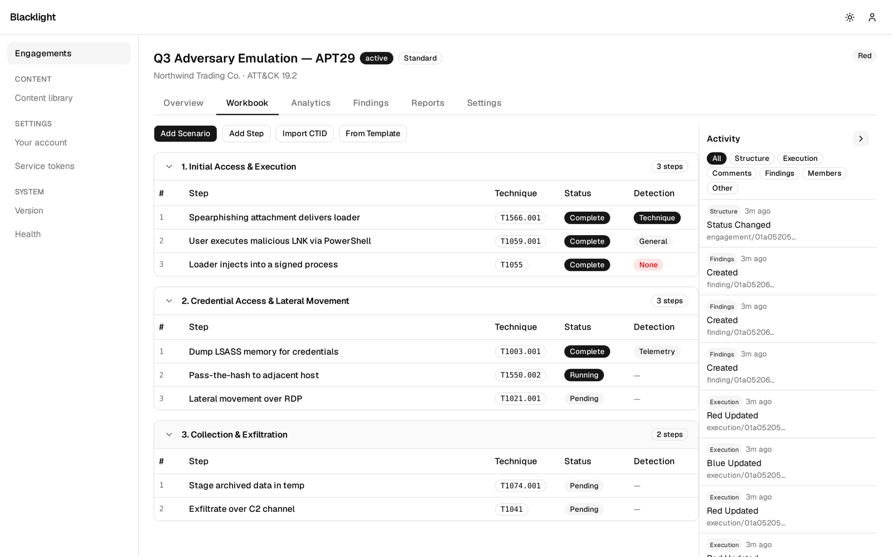

Blue rates each execution on the ATT&CK Evaluations scale, ordinal `none` (0) <
`telemetry` (1) < `general` (2) < `tactic` (3) < `technique` (4). Higher is
better coverage for them, and a lower rung is a stronger story for the report.
Category crossed with protection gives the derived **outcome** on each step:

| Example step | Category | Protection | Outcome |
|---|---|---|---|
| Spearphishing attachment `T1566.001` | `technique` | `blocked` | prevented |
| Encoded PowerShell `T1059.001` | `general` | `not_blocked` | detected |
| Process injection `T1055` | `none` | `not_blocked` | not detected |

**MTTD** is `detected_at − started_at`, computed only when both timestamps
exist — which is why pressing **Start** the instant you fire matters: a sloppy
start time inflates or breaks the metric that most embarrasses a slow SOC. The
full vocabulary — categories, modifiers, protection levels, and the derived
outcome table — is normative in [`scoring.md`](scoring.md).

## Raising findings

A missed or weak detection is a **finding**. Raise one straight from the
execution that exposed it, so the finding links back to that step and the
evidence trail stays intact, or from the Findings tab with **New finding**. Give
it a severity and a concrete remediation, because this is what blue works off and
what the retest re-runs.

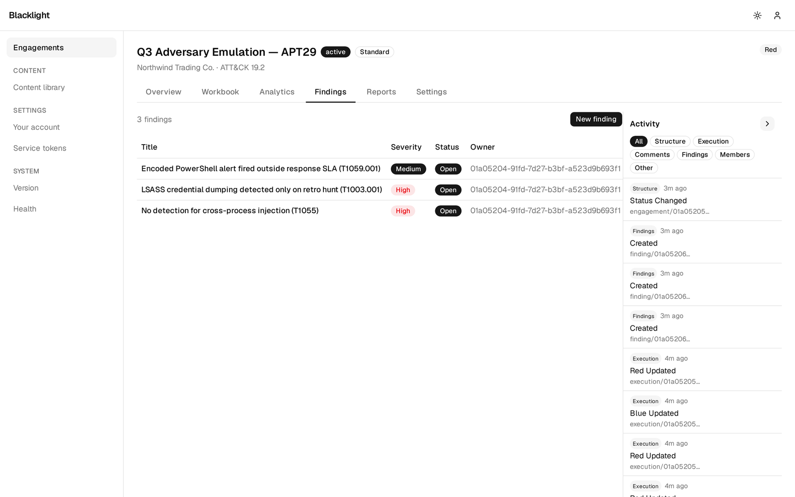

Write findings blue can act on: tie the finding to the ATT&CK technique, say what
telemetry *was* and *was not* present, and name the fix — "alert on `-enc` at
process start", "detect `CreateRemoteThread` into signed processes". A finding
with a concrete remediation is one the retest can verify closed.

## Measuring the outcome

The **Analytics** tab rolls the whole engagement into the numbers that go in the
report: **coverage** (techniques attempted), the **detection** distribution
across the ladder, **protection rate**, **MTTD** percentiles, and open findings —
over an ATT&CK **heatmap** coloured by how well each technique was caught.

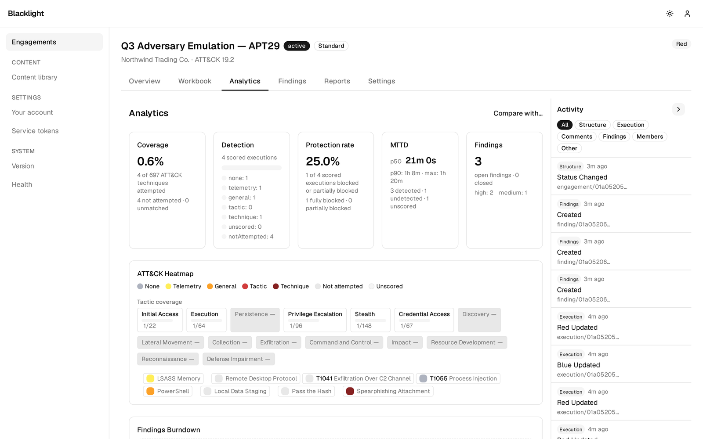

When remediation is done, the assessment runs a **retest** engagement against the
same techniques, and **Compare** prints the delta: coverage gained, MTTD dropped,
findings closed. That before-and-after is the point of the exercise — not that
you got in, but that you left the defenders measurably harder to get past next
time. The analytics vocabulary is defined in [`analytics.md`](analytics.md).

## Automating with the API

Building a large plan by hand is tedious. Under **Service tokens** you can mint a
scoped, expiring API token and drive the same endpoints — create scenarios and
steps, transition executions, attach evidence — from a script or your C2 tooling.
The REST API is spec-first with generated SDKs for Go, TypeScript, Python, and
Rust. Start with [`api-tokens.md`](api-tokens.md) and [`api.md`](api.md).

## What "done" looks like

Your executions, evidence, and findings are the raw material for the engagement
report, usually assembled by the lead. Leave every step complete, honestly
scored, and evidenced: a step left `pending` or a blank command is a hole in the
deliverable. The report prints from the record you left behind.
